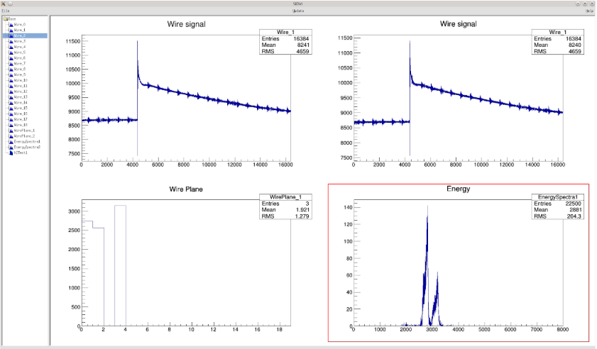

# SIDVI: MWPC Data Visualization Software
SIDVI (SIDACQ Visualization) is a ROOT-based graphical application designed for real-time visualization of experimental data, specifically histograms generated by the SIDACQ MWPC Data Analysis Software. It provides a robust interface to connect to a data analysis server, receive live updates of histograms and other ROOT objects, and display them in an interactive canvas.


## Overview
This software acts as a client to the analysis application (e.g., the SIDACQ Analysis software). It establishes a network connection, receives streamed ROOT histograms (1D, 2D, and 3D), and allows users to interact with these visualizations through a dedicated GUI. Its primary goal is to provide a dynamic and user-friendly platform for monitoring the results of ongoing data analysis.

## Features
- ROOT-based Graphical User Interface (GUI): Built entirely with ROOT's GUI toolkit (TGMainFrame, TRootEmbeddedCanvas, TGListTree), providing a native look and feel for ROOT users.

- Live Server Connection: Establishes a TCP/IP connection to a designated analysis server (default port 9090) to receive ROOT objects (histograms).

- Real-time Histogram Updates: Continuously refreshes displayed histograms on the canvas as new data or updated objects are received from the server.

- Interactive Canvas: Utilizes TRootEmbeddedCanvas to display histograms, allowing standard ROOT canvas interactions (zooming, panning, statistics boxes). The canvas is divided into multiple pads for displaying various plots simultaneously.

- Object List Tree with Drag & Drop (DnD):

    - Displays a list of available ROOT objects (histograms) received from the server in a TGListTree.

    - Supports drag-and-drop functionality, allowing users to drag objects from the list tree onto specific pads of the embedded canvas for custom layouts.

- Menu-driven Control: Provides intuitive menu options for:

    - Connecting to the analysis server.

    - Manually triggering canvas updates.

    - Opening local ROOT files (though primarily designed for live data).

    - Launching a generic ROOT object browser.

    - Creating new ROOT canvases.

    - Exiting the application.

- Status Bar: Provides feedback messages to the user regarding application status, server connection, and drag-and-drop events.

## Technologies Used
- ROOT Framework: The core framework for data analysis, histogramming, GUI development (TG* classes), and network communication (TSocket, TServerSocket, TMonitor, TMessage).

- C++: The primary programming language.

- TCP/IP Sockets: For inter-process communication between the analysis and visualization software.

## Code Structure
-   The project is structured into three main C++ files:

    - main.cpp:

        - The entry point for the application.

        - Initializes the ROOT TApplication and the main GUI window (sidView).

        - Starts the ROOT event loop.

    - sidview.h / sidview.cpp:

        - Defines the sidView class, which inherits from TGMainFrame and represents the main application window.

        - Manages the GUI layout, including the menu bar, list tree, embedded canvas, and status bar.

        - Handles user interactions via menu events and drag-and-drop.

        - Connects to and receives signals from the viewServer to update the GUI with received histograms.

        - Contains methods like HandleMenu for menu item actions, DataDropped for drag-and-drop logic, and RefreshCanvasInf for updating displayed histograms.

    - viewserver.h / viewserver.cpp:

        - Defines the viewServer class, responsible for handling the network communication with the data analysis application.

        - Acts as a server (TServerSocket) to accept incoming connections from the analysis software.

        - Uses TMonitor to listen for incoming TMessage objects, which contain the serialized ROOT histograms.

        - Runs in a separate TThread to avoid blocking the main GUI thread.

        - Stores received histograms (TH1, TH2, TH3) and provides them to sidView for display.

        - Emits signals (sigFinishedReg, sigSetCanData) to notify sidView when new histograms are registered or when the canvas data needs to be updated.

## Build and Run
1. Prerequisites:

    - ROOT data analysis framework installed and configured (version 6.x or newer recommended).

    - A C++ compiler (e.g., GCC).

2. Build:

    - Ensure your environment is set up for ROOT (e.g., source /path/to/root/bin/thisroot.sh).

    - Compile the source files. This typically involves using g++ and linking against ROOT libraries. 

3. Run:
```
./sidvi
```

## Usage
1. Start the SIDACQ Analysis Software: Ensure your data analysis application (the one sending ROOT objects) is running and configured to send data to localhost:9090 (or the appropriate IP/port).

2. Launch SIDVI: Run the sidvi executable.

3. Connect to Server: From the SIDVI GUI, go to File -> Server... to initiate the connection to the analysis server.

4. View Histograms: Once connected, histograms transmitted from the analysis software will appear in the left-hand List Tree.

5. Display Histograms:

    - Drag & Drop: Drag a histogram from the List Tree and drop it onto one of the pads in the right-hand canvas.

    - Automatic Update: The canvas will automatically refresh with the latest data for the displayed histograms at regular intervals. You can also manually trigger an update via Update -> Update....

6. Explore: Use the standard ROOT canvas interactions (right-click menus, toolbar buttons) to manipulate the displayed histograms (e.g., change drawing options, zoom).